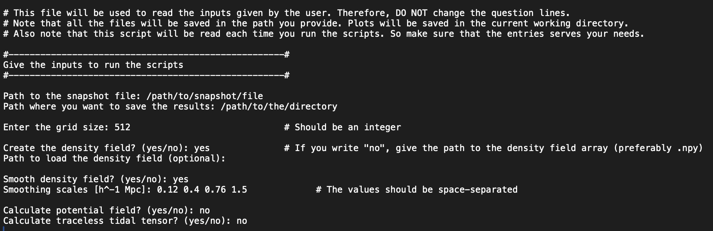
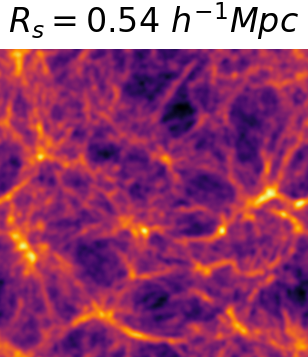
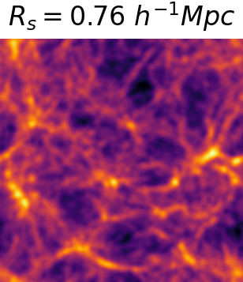
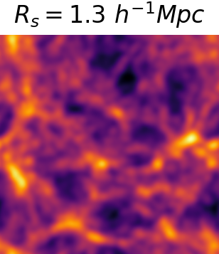
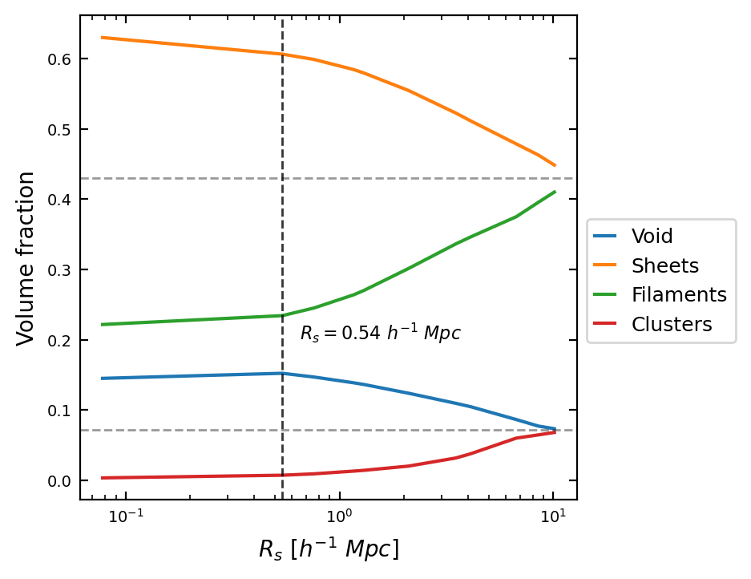
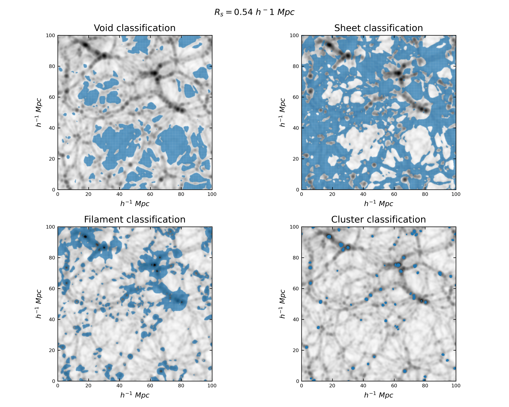
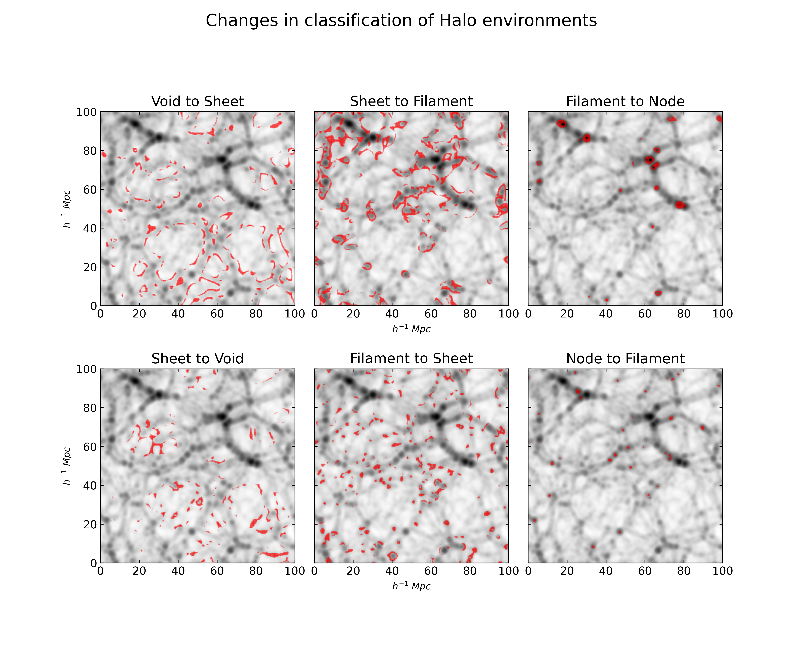

# T-Web Classification for the Cosmic Web

Welcome to the **T-Web Classification Analysis** project! This repository provides tools to calcualate and analyze the classification of cosmic large-scale structures based on the tidal fields in a cosmological simulation box for various smoothing scales. 

### Overview
This projects helps you perform calculations to derive the tidal fields from a simulation snapshot, which is further used to classify the large-scale structures in the simualation box. This is followed by visualizations that help better understand how the structures are classified and how they change with the smoothing scales.


## Features

- **Automated calculations and plotting** All the calculations are done automatically, from calculating the density field to classifying the structures of the Cosmic web. Moreover, although the plots are generated automatically, data is saved for the user for further analysis.
- **Volume Fraction Analysis**: Plot volume fraction of different large-scale structures against smoothing scales.
- **Classification plots**: Visualize how the cosmic structures are classified using T-web classification scheme.
- **Structural changes**: Shows how the number density of large-scale structures change when we alter the smoothing scales.


## Getting started
### Prerequisites
Before running the scripts, ensure you have the following:

- Python 3.x
- Libraries: NumPy, pynbody, Pylians3, tqdm, SciPy, matplotlib


### Instructions
Make sure to follow these instructions before running the scripts:
    
1. **Ensure required files**: All the files are in the current working directory.

2. **Modify `input_params.txt` file**: Edit the `input_params.txt` file to specify the requirement for your analysis. Here's a sample of what the file should look like:

<div style="text-align: center;">
    
</div>

3. **Run Required Scripts**: A brief description of what each python script does is given below:
- `Tidal_Field_Calculator.py`: This script is designed to compute the density field, tidal tensor, potential field, and traceless tidal shear tensor for a given cosmological N-body simulation snapshot. Users have the option to smooth the density field using a Gaussian filter.

- `T_web_Structure_Classifier.py`: This script classifies the structures based on T-web classification for given tidal shear tensor(s). The tidal shear tensor files are loaded and the eigenvalues and eigenvectors are calculated and further, the structures are classified based on T-web classification scheme.

- `Tweb_Classification_Analysis.py`: This script analyses the classification of structures based on the T-web classification. The volume fractions of different structures are plotted against the smoothing scales. The classification overlay on the density field is plotted for the given smoothing scales. The changes in the classification of particles are also plotted if the smoothing scales are changed.

Note: Ideally, you should run `Tidal_Field_Calculator.py` > `T_web_Structure_Classifier.py` > `Tweb_Classification_Analysis.py` 


4. **Run the script** Execute the scripts using the following command:
``` python3 script_name.py ```


## Output
The script generates various data files (.npy) and plots different features, as shown below:
- Density field smoothing for different smoothing scales
- LSS Volume Fractions vs Smoothing scale 
- Overlay of classified large-scale structures on density fields
- Changes number density of the environments when varying the smoothing scales.

#### Sample Output

<div style="text-align: center; padding-bottom: 20px">
    
    
    
</div>

<div style="text-align: center; padding-bottom: 20px">
    
</div>

<div style="text-align: center; padding-bottom: 20px">
    
</div>

<div style="text-align: center; padding-bottom: 20px">
    
</div>

<div style="text-align: center; padding-bottom: 20px">
    
</div>


## Author

- Asit Dave: [@asitdave](https://www.github.com/asitdave)


## Acknowledgements

 - Thanks to [Prof. Dr. Cristiano Porciani](https://astro.uni-bonn.de/en/m/porciani),  for his valuable guidance in developing this project.

 - My family and friends have been a constant source of motivation ❤️


## License

[MIT](https://choosealicense.com/licenses/mit/)


## Contact/Support

Email: [asit1700@gmail.com](mailto:asit1700@gmail.com)

